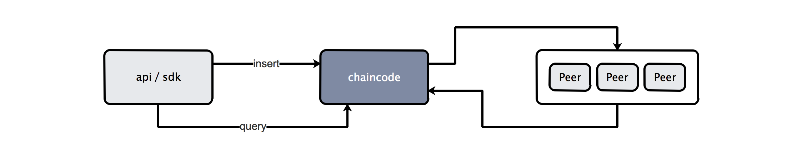
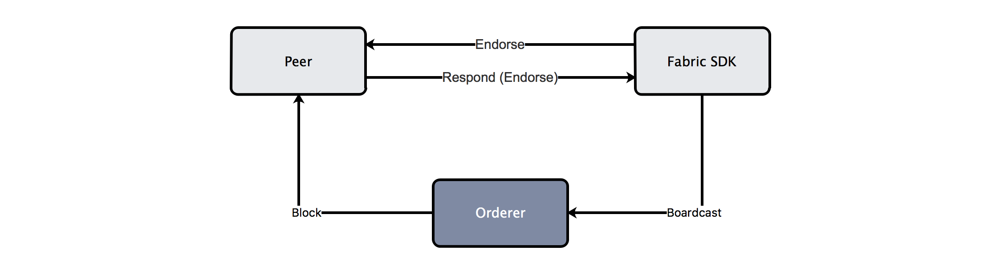
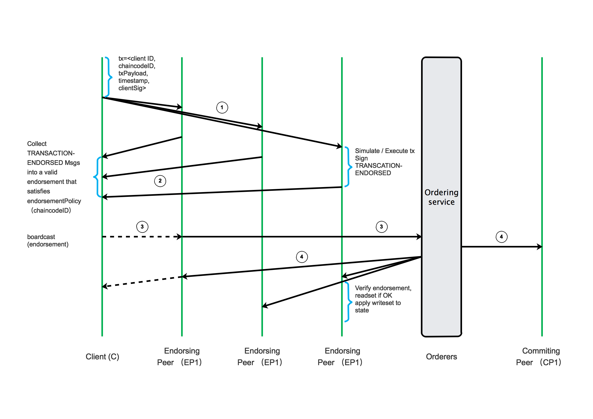

# [云框架]基于区块链的智能合约


[](CONTRIBUTORS.md)


区块链（[Blockchain](https://www.blockchain.com/)）是一种解决通过网络买卖商品和服务的双方之间的信任、透明性和责任性问题交易的支持工具，是用分布式数据库识别、传播和记载信息的智能化对等网络，也称为价值互联网。我们可以把区块链比作账本，区块代表账本中的一页，交易细节对所有人公开。

区块链1.0时代应用以比特币为代表，解决了货币和支付手段的去中心化问题；区块链2.0时代则是更宏观的对整个市场的去中心化，利用区块链技术来转换许多不同的资产，通过转让来创建不同资产单元的价值。**智能合约**便是这样的一种应用。

智能合约是将具体条款以计算机语言而非法律语言记录的智能化合同，运行在区块链的多个节点上（分布式环境），新建/调用都由区块链的**Transactions**触发。根据事件描述信息中包含的触发条件，智能合约在条件满足时自动发出预设的数据资源以及包括触发条件的事件，让一组复杂的、带有触发条件的数字化承诺能够按照参与者的意志，正确执行。
 
目前主流智能合约设计包括[Ethereum](https://www.ethereum.org/)和[Fabric](https://www.ibm.com/blockchain/hyperledger.html)。其中**Fabric**即IBM HyperLedger，采用Go和Java实现，运行于Docker中，可支持业务复杂度更高。

本篇[云框架](ABOUT.md)将以**慈善机构**为例，提供通过Fabric实现**基于区块链的智能合约**系统的最佳实践。

# 内容概览

* [快速部署](#快速部署)
* [业务说明](#业务说明)
* [框架说明](#框架说明)
    * [预先执行](#预先执行)
    * [事务执行](#事务执行)
    * [事务调用](#事务调用)
* [如何变成自己的项目](#如何变成自己的项目)
* [更新计划](#更新计划)
* [社群贡献](#社群贡献)

# <a name="快速部署"></a>快速部署

## 本地部署

1. [准备Docker环境](./READMORE/install-docker.md)

2. 克隆完整代码
 
    ```
    git clone https://github.com/cloudframeworks-blockchain/user-guide-fabric-smart-contract
    ```
    
3. 进入charity目录

    ```
    cd user-guide-blockchain/chaincode-docker-devmode
    ```

4. 使用docker-compose运行如下命令

    ```
    docker-compose -f docker-charity.yaml up -d
    ```

5. 访问

    http://127.0.0.1:8080/swagger        点击`try it out`填写事务命令进行操作
    
    或在终端执行命令`docker exec -it cli bash`进入shell后执行相应事务

# <a name="业务说明"></a>业务说明

利用区块链技术实现智能合约，某慈善机构将原有捐款流程升级改造为**透明、易追溯**的智能捐款系统，用户可自主完成以下事务——

1. 注册、初始捐款
2. 增加捐款额
3. 查询账户信息
4. 捐款（随机／指定捐款）
5. 查询捐款记录  
6. 查询余额信息

[查看事务命令](#事务命令)

业务流程如下图所示：



# <a name="框架说明"></a>框架说明

## <a name="预先执行"></a>预先执行

在事务执行前需预先执行**启动链码**及**安装链码与实例化**（本例已在docker compose执行中完成）

1. 启动链码（chaincode），执行于chaincode容器中，命令如下：

    ```
    CORE_PEER_ADDRESS=peer:7051 CORE_CHAINCODE_ID_NAME=charity:0 ./charity
    ```

2. 安装链码与实例化，执行于cli容器中，使用通道myc，命令如下：

    ```
    peer channel create -c myc -f myc.tx -o orderer:7050
    ```
    ```
    peer channel join -b myc.block
    ```
    ```
    peer chaincode install -p chaincodedev/chaincode/charity -n charity -v 0
    ```
    ```
    peer chaincode instantiate -n charity -v 0 -c '{"Args":[]}' -C myc
    ```

## <a name="事务执行"></a>事务执行

本例中包含<a name="事务命令"></a>事务命令可根据实际情况组合，示例如下：

* 执行捐款人（mike）捐献（donation）资金（2000）时，后段调用命令如下：

  ```
  peer chaincode invoke -n charity -c '{"Args":["donation", "mike", "2000"]}' -C myc
  ```
* 查询捐款人(mike)账户信息

  ```
  peer chaincode invoke -n charity -c '{"Args":["queryUserInfo", "mike"]}' -C myc
  ```
* 捐款人(mike)发生捐款指定捐赠“希望小学”

  ```
  peer chaincode invoke -n charity -c '{"Args":["donationRules", "mike","assign", "Hope_ Primary_School"]}' -C myc
  ```

* 捐款人(mike)随机选款，由慈善机构的合约进行选择捐赠

  ```
  peer chaincode invoke -n charity -c '{"Args":["donationRules", "mike","random"]}' -C myc
  ```

* 捐款人(mike)查询的捐款次数和去向

  ```
  peer chaincode invoke -n charity -c '{"Args":["queryDealALL", "mike"]}' -C myc
  ```

* 捐款人(mike)查询自己的第2次捐款去向

  ```
  peer chaincode invoke -n charity -c '{"Args":["queryDealOnce", "mike", "2"]}' -C  myc
  ```

* 捐款人(mike)追加捐款40000元

  ```
  peer chaincode invoke -n charity -c '{"Args":["donation", "mike", "40000"]}' -C myc
  ```

具体流程见下图：



[点击查看详细流程图](./image/fabric_struct.png)

* [Cli & Peer & Oderer](https://hyperledger-fabric.readthedocs.io/en/latest/arch-deep-dive.html#client)
* 应用程序请求道Peer节点（一个或多个）
* peer节点分别执行交易（通过chaincode），但是并不将执行结果提交到本地的账本中（可以认为是模拟执行，交易处于挂起状态），参与背书的peer将执行结果返回给应用程序（其中包括自身对背书结果的签名）
* 应用程序 收集背书结果并将结果提交给Ordering服务节点
* Ordering服务节点执行共识过程并生成block，通过消息通道发布给Peer节点，由peer节点各自验证交易并提交到本地的ledger中（包括state状态的变化）

## <a name="事务调用"></a>事务调用



交易流程由应用客户端发送给特定背书节点的transaction proposal组成。背书节点验证客户端签名，并执行chaincode功能来模拟transaction。输出是链码结果，在链码（读集）中读取的一组键/值版本以及以链码（写集）编写的一组键/值。带有背书签名的proposal响应将被发送回客户端。 客户端将签名装配到transaction有效负载中并将其广播到ordering服务。ordering服务将有序交易作为块传送到这个通道上的所有peers。

在交付之前，peers将验证交易。首先，他们将检查背书策略，以确保指定peer已经对结果进行了签名，并且将根据交易有效负载来验证签名。

其次，peers将针对交易读集执行版本检查，以确保数据的完整性，并防止双花等威胁。Hyperledger Fabric具有并发控制，其中transaction并行执行（通过背书节点）以增加吞吐量，并且在提交（由所有peers）每个transaction时，每个transaction都被验证，以确保没有其他transaction已经修改了已读取的数据。换句话说，它确保在chaincode执行（背书）期间需要读取的数据没有改变，因此执行结果有效，并且可以提交到账本状态数据库。如果读取的数据已被其他transaction更改，则块中的transaction被标记为无效，并且不会写入账本状态数据库。客户端应用程序被提醒，然后可以控制错误或重新尝试。

进一步了解[Transation Flow](http://hyperledger-fabric.readthedocs.io/en/latest/txflow.html)

# <a name="如何变成自己的项目">如何变成自己的项目

1. 根据具体业务编写链码文件，结构参考：@pujielan 说明清楚一些

    * 关键引用

        ```
        "github.com/hyperledger/fabric/core/chaincode/shim"
        "github.com/hyperledger/fabric/protos/peer"
        ```

    * func Init（作用于链码实例化）

        ```
        func (s *SmartContract) Init(api shim.ChaincodeStubInterface) peer.Response {
	       return shim.Success(nil)
        }
        ```

    * func Invoke（方法判断，作用于invoke调用时对参数的处理）

        ```
        func (s *SmartContract) Invoke(api shim.ChaincodeStubInterface) peer.Response {

	       function, args := api.GetFunctionAndParameters()

	       switch function {
	       case "donation":
		      return s.donation(api, args)
	       case "queryDealOnce":
		      ...
	       }

	       return shim.Error("Invalid function name.")
        }
        ```

    例如`-c '{"Args":["donation", "xxxx", "2000"]}'`中，即调用了donation方法执行了后续业务处理。可理解为，在写链码程序时这里即是需要按照自己的业务进行修改的合约逻辑。

2. 将链码放置于容器中

    下载go环境镜像，编译链码，推荐本例中使用的name为chaincode的镜像进行

    ```
    docker exec -it chaincode bash
    cd $yourProj
    go build
    ```

3. 修改`docker-charity.yml`文件
    
    * 修改[script.sh](https://github.com/cloudframeworks-blockchain/user-guide-fabric-smart-contract/blob/master/chaincode-docker-devmode/script.sh)中的channel注册与chaincode实例化

    ```
    peer channel create -c myc -f myc.tx -o orderer:7050

    peer channel join -b myc.block

    sleep 10
    
    CORE_PEER_ADDRESS=peer:7051 CORE_CHAINCODE_ID_NAME=charity:0 /opt/gopath/src/chaincodedev/chaincode/charity/charity &
    
    peer chaincode install -p chaincodedev/chaincode/charity -n charity -v 0
    
    peer chaincode instantiate -n charity -v 0 -c '{"Args":[]}' -C myc
    ```
    * 将cli的entrypoint指令指定为你个人的chaincode
    * peer中的entrypoint指令,指定安装以及实例化你个人的chaincode

3. 运行docker-compose文件

    ```
    bash init_tx.sh
    docker-composer -f docker-charity.yml up -d
    ```

4. 完成

    登入cli容器中，可以进行命令操作了

5. webserver

    如虽然Fabric使用go开发，但是其本身并未提供go sdk（[Hyperledger Fabric SDKs](http://hyperledger-fabric.readthedocs.io/en/latest/fabric-sdks.html?highlight=sdk)），因此建议使用Java或Node实现webserver接入。
    本例调用了shell完成处理并为进行go sdk包装，您也可以参考一些go sdk项目，如[fabric-sdk-go](https://github.com/hyperledger/fabric-sdk-go)、[gohfc](https://github.com/CognitionFoundry/gohfc)等。

# <a name="更新计划"></a>更新计划

* `文档` 内容扩展
* `CODE` 增加自建go sdk
* `CODE` 优化展示界面 

点击查看[历史更新](CHANGELOG.md)

# <a name="社群贡献"></a>社群贡献

+ QQ群: 644955229
+ [参与贡献](CONTRIBUTING.md)
+ [联系我们](mailto:info@goodrain.com)

-------

[云框架](ABOUT.md)系列主题，遵循[APACHE LICENSE 2.0](LICENSE.md)协议发布。

